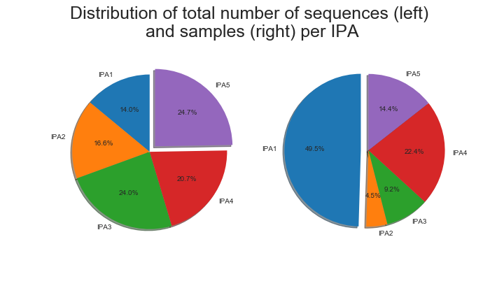
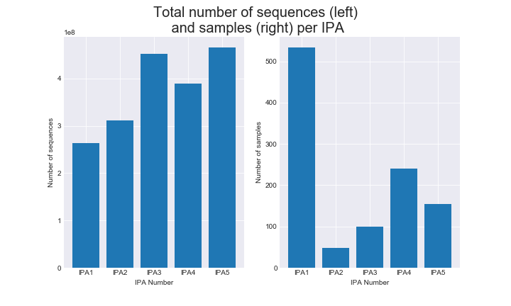
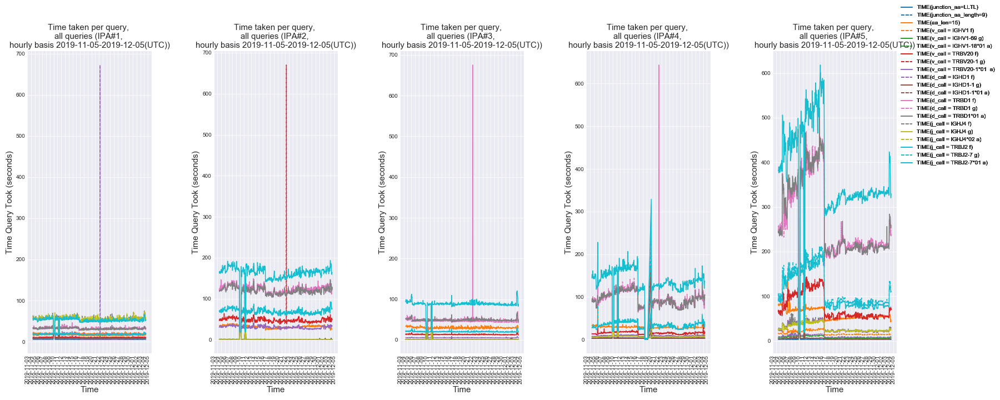
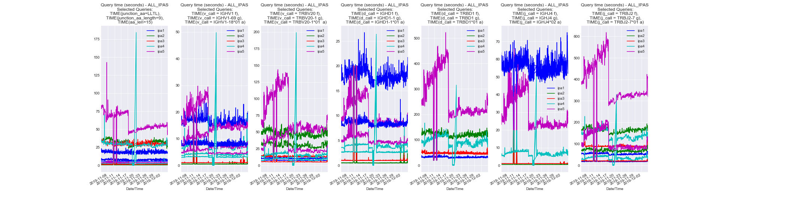

# Performance Script

## Stage 1: Perform queries

### Usage

`
python3 queries.py -h
`

    usage: queries.py [-h] [-v] output_dir ipa_arr
    
    positional arguments:
        output_dir     Indicate the full path to where performance test results will be stored
        ipa_arr        Array containing URL to API service

    optional arguments:
       -h, --help     show this help message and exit
       -v, --verbose  Run the program in verbose mode.
       
#### Scenario A: Serial performance testing

    ./run_queries.sh "https://ipa1.ireceptor.org,https://ipa2.ireceptor.org/,https://ipa3.ireceptor.org/"

#### Scenario B: Simultaneus performance testing
    ./run_queries.sh "https://ipa1.ireceptor.org"
    ./run_queries.sh "https://ipa2.ireceptor.org/"
    ./run_queries.sh "https://ipa3.ireceptor.org/"

## Stage 2: Generate plots from query results 

### Usage

`
python3 plot_performance.py -h
`

    usage: plot_performance.py [-h] [-v] path s_date e_date
      
    positional arguments:
        path           Full path to directory where performance CSV results are stored
        s_date         Start Date of performance monitoring period. Format: YYYY-MM-DD
        e_date         End Date of performance monitoring period. Format: YYYY-MM-DD
      
     optional arguments:
        -h, --help     show this help message and exit
        -v, --verbose  Run the program in verbose mode.

## Sample plots generated with plot performance script

